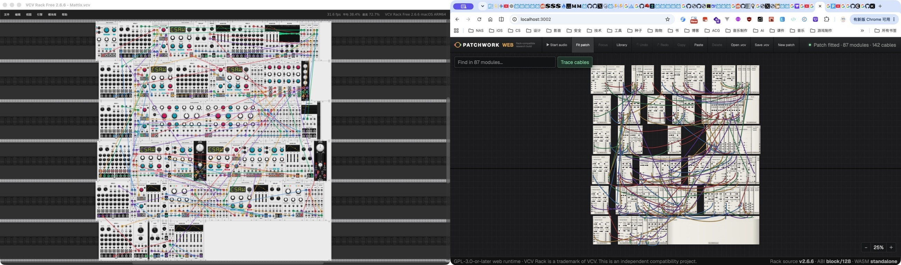

# Peach Patch interaction model

Peach Patch keeps Rack's direct module-and-cable model while using browser-native navigation, inspection, files, and accessibility semantics. The goal is not to reproduce every desktop menu. The goal is to keep signal flow visible, make dense patches navigable, and preserve manual patching without hiding structural changes behind automation.

## Product principles

1. **Signal flow stays primary.** Modules, jacks, plugs, and cables occupy the main surface; editing tools appear in the Library, inspector, context menus, or direct gestures.
2. **Every structural change is explicit and undoable.** Add, move, connect, reconnect, stack, insert, replace, heal, and delete operations enter patch history.
3. **Rack semantics win at the patch boundary.** Port direction, cable stacking, polyphony, bypass, panel widths, row geometry, parameter IDs, and `.vcv` data are not reinterpreted as generic audio-app concepts.
4. **The browser owns browser concerns.** File handles, PatchStorage fetching, IndexedDB assets, Web MIDI devices, responsive layout, and accessible controls stay outside module DSP.
5. **Performance state does not become hidden patch structure.** Perform mode locks destructive editing but leaves audio and controls live; leaving it restores the same visible patch.

## Primary workflow

### Open or create

- **New** creates an empty patch.
- **Open** uses the standard accessible file input for plain or compressed `.vcv` files.
- **Link** accepts a public PatchStorage page and opens its `.vcv` through the constrained Worker route.
- **Save** uses a browser save handle where supported and otherwise downloads Rack-compatible JSON.

Import waits for the registry and checks every module before replacing the current patch. A blocked or invalid patch opens an explanatory dialog and leaves the current work untouched.

### Find and place modules

The Library searches the currently loaded registry by model, plugin, brand, and description. An exact official VCV Library URL can resolve public metadata, but its key still needs a published Peach Patch package.

- Click a Library card to add it at an open rack position.
- Drag a Library card onto one selected module to replace it while preserving compatible parameters and cables.
- Select one cable, then choose a compatible module to splice it into that signal path.
- Right-click empty rack space to open Quick Add at that world position.
- The rack surface expands in all directions and keeps modules on the 15 px HP by 380 px row grid.

### Navigate and select

- Drag empty rack space with the primary or middle pointer to pan.
- Use an ordinary wheel/trackpad gesture to pan; hold <kbd>Cmd</kbd>/<kbd>Ctrl</kbd> while scrolling to zoom around the pointer.
- Use one-finger touch to pan and two-finger pinch to zoom around the gesture midpoint.
- Use the lower-right controls for zoom out, zoom in, and fit-to-patch.
- Double-click a module header to center it at an editable zoom.
- Click a module or cable to select it; modifier-click adds to the selection.
- <kbd>Shift</kbd>-drag empty rack space to add intersecting modules with a marquee.
- Drag one selected module to move the selected group; movement remains grid-snapped and collision-aware.

Fit is an overview command, not an editing guarantee. A dense patch may make controls intentionally too small to edit; focus or zoom before changing parameters or cables.

## Cable interaction

Every routable input and output supports a cable stack.

| Action | Result |
| --- | --- |
| Drag an empty jack to a compatible jack | Create a new cable |
| Click two compatible jacks | Create the same connection through the accessible click path |
| Drag a visible plug | Move that cable endpoint while the other end stays anchored |
| Release a moved plug on empty rack | Disconnect that cable |
| <kbd>Cmd</kbd>/<kbd>Ctrl</kbd>-drag an occupied jack or plug | Start an additional cable and keep the existing stack |
| Right-click a cable | Recolor, insert a compatible module, or delete it |

Exact duplicate edges are refused. Output stacks fan a signal out; input stacks sum voltages per channel. The live drag preview follows the pointer and uses the same resolved jack centers as the final cable.

## Module interaction

Selecting one module opens the inspector. It provides:

- live input/output voltages and bounded waveform scopes;
- every compatible non-button parameter with a numeric value;
- typed Rack state controls, including nested and indexed data;
- a next-CC MIDI-learn target when a Core MIDI-Map module and live MIDI input are available;
- source attribution, replace, duplicate, initialize, randomize, disconnect, and `.vcvm` preset actions.

Right-clicking a module exposes the same structural actions plus bypass and registry-declared context-only controls. Double-clicking a supported parameter resets its dynamic or declared default. Custom module displays and gestures are explicit registry visual/action contracts rather than guessed DOM overlays.

## Keyboard commands

Keyboard commands are ignored while focus is in an input, textarea, select, or editable element.

| Command | Action |
| --- | --- |
| <kbd>Cmd</kbd>/<kbd>Ctrl</kbd> + <kbd>Z</kbd> | Undo |
| <kbd>Cmd</kbd>/<kbd>Ctrl</kbd> + <kbd>Shift</kbd> + <kbd>Z</kbd>, or <kbd>Cmd</kbd>/<kbd>Ctrl</kbd> + <kbd>Y</kbd> | Redo |
| <kbd>Cmd</kbd>/<kbd>Ctrl</kbd> + <kbd>C</kbd> / <kbd>V</kbd> | Copy / paste selected modules and their internal cables |
| <kbd>Cmd</kbd>/<kbd>Ctrl</kbd> + <kbd>D</kbd> | Duplicate selection |
| <kbd>Cmd</kbd>/<kbd>Ctrl</kbd> + <kbd>A</kbd> | Select all modules |
| <kbd>Delete</kbd> / <kbd>Backspace</kbd> | Delete selected modules or cables |
| <kbd>Shift</kbd> + <kbd>Delete</kbd> / <kbd>Backspace</kbd> | Heal-delete one unambiguous serial module |
| <kbd>Cmd</kbd>/<kbd>Ctrl</kbd> + <kbd>Shift</kbd> + <kbd>P</kbd> | Toggle Perform mode |
| <kbd>Cmd</kbd>/<kbd>Ctrl</kbd> + <kbd>Shift</kbd> + <kbd>R</kbd> | Start or stop parameter automation recording |
| <kbd>Cmd</kbd>/<kbd>Ctrl</kbd> + <kbd>Shift</kbd> + <kbd>Space</kbd> | Start or stop automation playback |
| <kbd>Escape</kbd> | Close an open module or cable context menu |

Perform and automation are expert shortcuts rather than persistent toolbar controls. Perform mode blocks structural/history commands and collapses the Library while parameters, Web MIDI, and audio remain active.

## Live performance feedback

The global audio action is isolated at the right side of the compact header. Starting audio creates one worklet graph and requests Web MIDI permission during the user gesture. Status changes are announced through the application's live region rather than occupying a permanent footer.

Connected plugs and cables receive bounded live signal telemetry. Selecting a module enables its detailed inspector scopes. Registry-declared lights and custom displays render from worklet data without turning telemetry into serialized patch state.

Automation records panel gestures and mapped CC changes into the patch. Playback is scheduled from the AudioWorklet clock. Capture-capable modules download WAV or MIDI data, and module asset controls keep selected audio/images/MIDI/ROM/scripts in the current browser profile.

## Reference comparison

### VCV Rack

VCV Rack remains the reference for native plugin compatibility, official custom drawing, desktop audio/MIDI devices, and exact host behavior. Peach Patch intentionally adds browser-local advantages: public-link import, no plugin installation/restart loop, one searchable web catalog, native file downloads, responsive viewport controls, semantic HTML actions, and live inspector scopes.

The browser runtime does not claim pixel or host parity for every module. Source-derived geometry and official public panel imagery are used where valid; dynamic or native-only widgets fall back to bounded browser controls.

### Grid-style workflow ideas

Peach Patch adopts several useful modular-editor ideas without replacing Rack semantics:

- lock structure for performance;
- insert a module directly on a cable;
- heal a simple serial path on deletion;
- replace a selected module while retaining compatible connections;
- keep contextual controls and live port inspection beside the patch.

All of these remain explicit patch operations with undo support.

## Historical Mattix evidence

The preserved July 19, 2026 comparison used an 87-module, 142-cable `Mattix.vcv` patch in VCV Rack Free 2.6.6 and the then-current browser build.

That image is historical evidence, not a current registry-count guarantee. Later code changed product naming, toolbar density, cable stacking, compatibility blocking, registry ownership, and testing gates. Detailed dated measurements remain in [`design-qa.md`](../design-qa.md) and the archived [workflow audit](../artifacts/ux-audit-2026-07-18/AUDIT.md).

## Current gaps

- Whole-patch fit remains primarily navigational on very dense graphs.
- Cable search/isolation is not part of the current compact interface.
- Perform and automation shortcuts need stronger in-product discoverability.
- Complete screen-reader flow, keyboard focus order, reduced-motion behavior, contrast, and reflow still require dedicated accessibility verification beyond unit/render tests.
- Browser output is stereo, and native audio inputs or extra device channels are not yet routed.
- PatchStorage is import-only; there is no Peach Patch cloud account or cloud save.
- Browser-local module assets are referenced, not embedded, in exported patches.
- Native custom drawing and desktop host behavior still require explicit per-module browser translations.

Product work should prioritize these cross-cutting interaction and accessibility gaps before adding one-off exceptions for individual audio modules.
